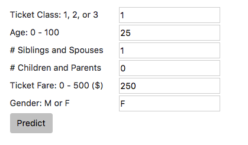

# Flask and Data Science Workshop
#### Seattle Building Intelligent Applications Meetup 

Aaron Lichtner, Data Scientist @ Nordstrom

*September 6, 2017*

*Metis Seattle*

---

Flask is a web framework for Python. In other words, it's a way to use python to create websites, web apps and APIs.

### Workshop Topics
 - [Creating your flask dev environment](#creating-your-flask-environment)
 - [Flask App Organization](#flask-app-organization)
 - [Deploying a basic flask app](#basic-flask-app)
 - [Train a model in flask](#now-lets-do-some-data-science)
 - [Using a Bootstrap templates to add some style](#rendering-html-templates-using-flask)
 - [Passing data and predicting with our model](#hooking-it-all-up)
 - [Jinja templating with flask](#jinja-templating)
 
# Creating your Flask Environment
### python 3

- Install virtualenv
`pip3 install virtualenv`

- Set up the virtual environment
`virtualenv -p python3 venv3`

- Activate the virtual environment
`source venv3/bin/activate`

- Install the needed packages
`pip install -r requirements.txt`

### python 2

- Install virtualenv
`pip install virtualenv`

- Set up the virtual environment
`virtualenv -p python2 venv2`

- Activate the virtual environment
`source venv2/bin/activate`

- Install the needed packages
`pip install -r requirements.txt`

## Flask App Organization
Flask has some basic requirements when it comes to file and folder structure.
```python
# the most basic flask app
 yourapp/
    |
    | - app.py
```
- Example of a more complex application structure
```python
# typical app structure
 yourapp/
    |
    | - app.py
    | - static/
            | - css/
            | - resources/
            | - js/
    | - templates/
            | - index.html
    | - data/
```

# Basic Flask App

1. From the root directory, open your `app.py` file, import flask and create your flask object.
```python
from flask import Flask

# create the flask object
app = Flask(__name__)
```

2. Add your first route. Routes connect web pages to unique python functions. In this example, the root page of the site, `yoursite/`, should trigger the `home()` function and return 'Hello World!' as the server response to the webpage. 
```python
# routes go here
@app.route('/')
def home():
    return 'Hello World!'
```

3. Now just add some code at the bottom to tell python what to do when the script is run.
```python
# script initialization
if __name__ == '__main__':
    app.run(debug=True)
```
- *Note: `debug=True` allows for quicker development since you don't have to keep restarting your app when you change it.*

4. Run `python app.py`

5. Check it out!

- [Your Locally Running App](http://127.0.0.1:5000/)

6. Let's add another route. Rather than just pure text, let's return some HTML.

```python
@app.route('/jazzhands')
def jazzhands():
    return "<h1>Here's some <i>Pizzazz!</i></h1>"
```

7. One final route in our basic app. This route will use what's known as **dynamic routing**. These allow more flexibility with your urls and the ability to pass variables straight through the url. Variables must be passed in between angled brackets '<>' after the root of the url, in this case `/twice/`.

```python
@app.route('/twice/<int:x>') # int says the expected data type
def twice(x):
    output = 2 * x
    return 'Two times {} is {}'.format(x, output)
```
 
 #### Your turn: 
 8. Add a dynamic route `/login` that takes in a username and returns a personalized greeting to that user.
   - *Note: When dynamically passing strings you don't need to specify the data type*


# Now let's do some Data Science

We will be building a survival classifier using the [Titanic Survival Dataset](https://www.kaggle.com/c/titanic/data). Our goal is to create an interface for a user to make and view predictions.

The code to read in the data, split it up and train the model has already been written for you. We're going to focus on how to implement the model and predict with it through the flask web interface. 

- If you want more info on models for this dataset take a look here. [Titanic Dataset Modeling](https://blog.socialcops.com/engineering/machine-learning-python/)

### Install and import additional packages 
1. If you haven't already done so, make sure you have all the required packages in your virtualenv.

```bash
pip install pandas
pip install sklearn
pip install scipy

or 

pip install -r requirements.txt
```


2. Import the libraries required for modeling. `render_template` and `request` are needed for us to get data from the web interface to the flask app and then to present the results in a more visually appealing way than basic text.
```python
from flask import Flask     # you already should have this 
from flask import render_template, request

# modeling packages
import pandas as pd
import numpy as np
from sklearn.linear_model import LogisticRegression
from sklearn.model_selection import train_test_split
from sklearn.metrics import classification_report
```

### Build the model
3. The following code will read in the `titanic_data.csv`, clean it up, select the pertinent features, split the data into test and training sets and then train a simple logistic regression model to predict the probability of survival. Paste this code right at the start of the script initialization. The model will be available in the namespace of the flask app.

```python
# read in data and clean the gender column
if __name__ == '__main__':
    # build a basic model for titanic survival
    titanic_df = pd.read_csv('data/titanic_data.csv')
    titanic_df['sex_binary'] = titanic_df['sex'].map({'female': 1, 'male': 0})
    
    # choose our features and create test and train sets
    features = [u'pclass', u'age', u'sibsp', u'parch', u'fare', u'sex_binary', 'survived']
    train_df, test_df = train_test_split(titanic_df)
    train_df = train_df[features].dropna()
    test_df = test_df[features].dropna()
    
    features.remove('survived')
    X_train = train_df[features]
    y_train = train_df['survived']
    X_test = test_df[features]
    y_test = test_df['survived']
    
    # fit the model
    L1_logistic = LogisticRegression(C=1.0, penalty='l1')
    L1_logistic.fit(X_train, y_train)
    
    # check the performance
    target_names = ['Died', 'Survived']
    y_pred = L1_logistic.predict(X_test)
    print(classification_report(y_test, y_pred, target_names=target_names))
    
    # start the app
    app.run(debug=True)
```

4. Rerunning the script now should show us the classification_report from the logistic regression model in the terminal. We haven't hooked up any flask routes to the model however. Let's change that.

### Rendering HTML templates using Flask
5. I've created a basic HTML template where we can build a user interface for predicting with our amazing model.

```python
@app.route('/titanic')
def titanic():
    return render_template('titanic.html')
```

6. Go to the [Titanic Template](http://127.0.0.1:5000/titanic) to see where you will be interfacing with the user.

## Hooking it all up
### Getting prediction inputs into flask

Our model uses the following variables to predict whether someone would have survived the titanic:
- Ticket Class
- Age
- \# Siblings & Spouses 
- \# Children & Parents
- Ticket Fare
- Gender

In order to hook up the web interface with the model we have to allow the user to input all of the required model parameters. The easiest way to do this is with a simple web form. 



7. In the `titanic.html` file, add the following code. This creates our webform, labels the inputs so we can grab them later and implements the `predict` button that sends the form to the `/titanic` flask route.`
```html                
            <!-- The web form goes here -->
            <form action="/titanic" method="post" id="titanic_predict">
                 <div>
                    <label for="name">Ticket Class: 1, 2, or 3</label>
                    <input type="text" id="class" name="predict_class" value=1>
                </div>
                <div>
                    <label for="name">Age: 0 - 100 </label>
                    <input type="text" id="age" name="predict_age" value=25>
                </div>
                <div>
                    <label for="name"># Siblings and Spouses</label>
                    <input type="text" id="sibsp" name="predict_sibsp" value=1>
                </div>
                <div>
                    <label for="name"># Children and Parents</label>
                    <input type="text" id="parch" name="predict_parch" value=0>
                </div>
                <div>
                    <label for="name">Ticket Fare: 0 - 500 ($) </label>
                    <input type="text" id="fare" name="predict_fare" value=250>
                </div>
                <div>
                    <label for="name">Gender: M or F</label>
                    <input type="text" id="sex" name="predict_sex" value='F'>
                </div>
            </form>
            <button class="btn" type="submit" form="titanic_predict" value="Submit">Predict</button>
```
When you go check out your page you should see the web form there for you. Press the predict button though and you'll get an error saying that method isn't allowed. Flask routes by default enable the 'GET' method but if we want to allow any additional functionality, such as submitting data to the flask server via a webform we'll need to enable those explicitly.

8. Update the `methods` parameter to allow both 'GET' and 'POST' methods on the `/titanic` route.
```python
@app.route('/titanic', methods=['GET','POST'])
def titanic():
    return render_template('titanic.html')
```

9. Request the data from the web form inside the flask function.

```python
def titanic():
    data = {} 
    if request.form:
        # get the form data
        form_data = request.form
        data['form'] = form_data
        predict_class = float(form_data['predict_class'])
        predict_age = float(form_data['predict_age'])
        predict_sibsp = float(form_data['predict_sibsp'])
        predict_parch = float(form_data['predict_parch'])
        predict_fare = float(form_data['predict_fare'])
        predict_sex = form_data['predict_sex']
        print(data)
    return render_template('titanic.html')
```
10. Test the connection from the web page to the flask function using the **predict** button to make sure data is being passed from the web form by printing it to the terminal. We will be feeding this data into our model to make our predictions.

### Prepare input data and get the prediction

11a. Convert the `predict_sex` variable from a string into binary (F = 0, M = 1).

11b. Build the numpy array of values `input_data` to pass into the model. The order **DOES** matter. 

11c. Call the `predict_proba()` method on the logistic regression model with our input data. 

11d. Grab the **survival probability** from the prediction and put it into the `data` dictionary to be passed back to the web page.

```python
def titanic():
    data = {} 
    if request.form:
        # get the form data
        form_data = request.form
        data['form'] = form_data
        predict_class = float(form_data['predict_class'])
        predict_age = float(form_data['predict_age'])
        predict_sibsp = float(form_data['predict_sibsp'])
        predict_parch = float(form_data['predict_parch'])
        predict_fare = float(form_data['predict_fare'])
        predict_sex = form_data['predict_sex']
        
        # convert the sex from text to binary
        if predict_sex == 'M':
            sex = 0
        else:
            sex = 1
        input_data = np.array([predict_class, predict_age, predict_sibsp, predict_parch, predict_fare, sex])
        
        # get prediction
        prediction = L1_logistic.predict_proba(input_data.reshape(1, -1))
        prediction = prediction[0][1] # probability of survival
        data['prediction'] = '{:.1f}% Chance of Survival'.format(prediction * 100)
    return render_template('titanic.html', data=data)
``` 
### Jinja Templating

We are now getting the input data from the form and predicting with it. Now we have to tell the client-side how to display the information. We will be using Jinja templating to control how data from the server is displayed. 

12. Add the following to `titanic.html`. In Jinja, we access data objects inside double brackets, i.e. `{{}}`. 
```html
        <div class="col-lg-6">
            <!-- Result presentation goes here -->
            {{data}}
        </div>
```

Take a look at the `/titanic` page and you can see that all the bits and pieces are hooked up. Time to do just a bit of UI work. Jinja allows you to use python-like logic to control the HTML that is displayed. 

13. In the `titanic.html` file, use a simple **if** statement to prevent displaying anything if a prediction is not present. Then add some HTML to structure what the user will see. Here we want to show the prediction and the input parameters they put into the model.
```html
         <div class="col-lg-6">
            <!-- Result presentation goes here -->
            
                <h1>{{data.prediction}}</h1>
                <h5>Ticket Class: {{data.form.predict_class}}</h5>
                <h5>Age: {{data.form.predict_age}}</h5>
                <h5>Siblings & Spouses: {{data.form.predict_sibsp}}</h5>
                <h5>Children & Parents: {{data.form.predict_parch}}</h5>
                <h5>Ticket Fare: ${{data.form.predict_fare}}</h5>
                <h5>Gender: {{data.form.predict_sex}}</h5>
            
        </div>
```

## That's It! (we hope)

[Fully Hooked Up Titanic Survival Model](http://127.0.0.1:5000/titanic)

At this point you should hopefully have a fully function flask-based web app that trains a model off real data and presents a simple interface to a user to allow them to make a prediction with the model and see the results. 

# Keep Going!
- plot a visualization of the data and present it on the web page
- have the `titanic/` route return a representative image based on the prediction of survive or not survive
- train an entirely different model and create a new route to its results


# More Resources
- [Flask Documention](http://flask.pocoo.org/)
- [Free Bootstrap HTML Templates](https://startbootstrap.com/)
- [Jinja Templating](http://jinja.pocoo.org/)
- [Flask Mega-Tutorial](https://blog.miguelgrinberg.com/post/the-flask-mega-tutorial-part-i-hello-world)


### Further Questions: 
- Aaron Lichtner, Data Scientist @ Nordstrom
- LinkedIn: https://www.linkedin.com/in/aaronlichtner/
- Email: [aaron.lichtner@nordstrom.com](aaron.lichtner@nordstrom.com)

### We're Hiring!
#### [Nordstrom Tech Careers ](http://about.nordstrom.com/careers/#/headquarters-careers/main)